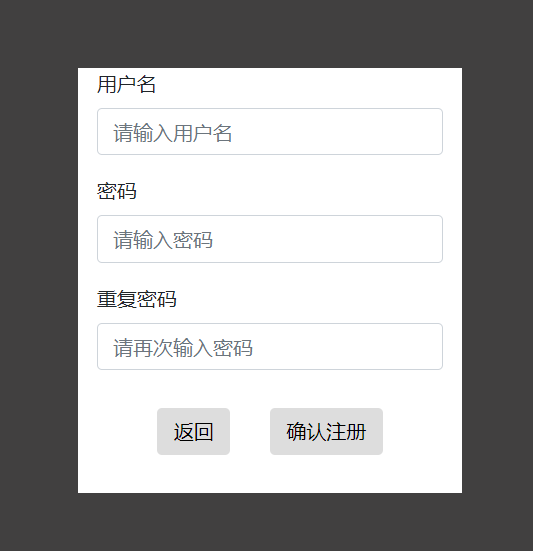
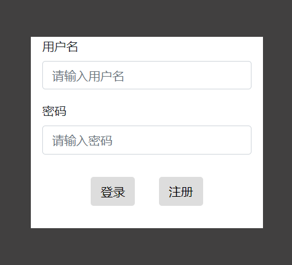
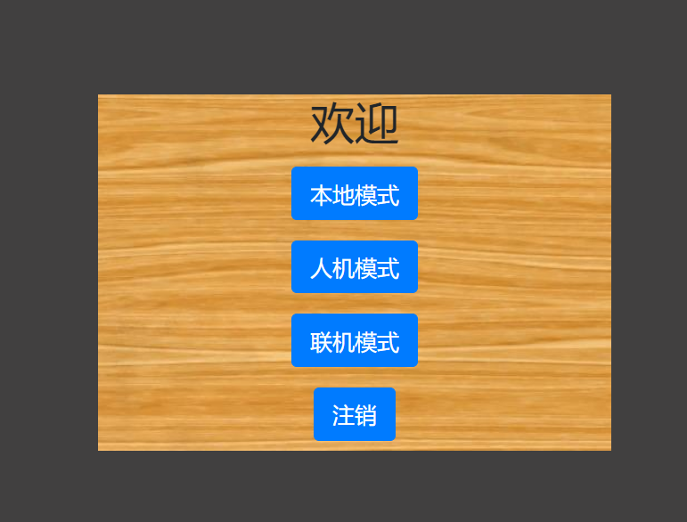
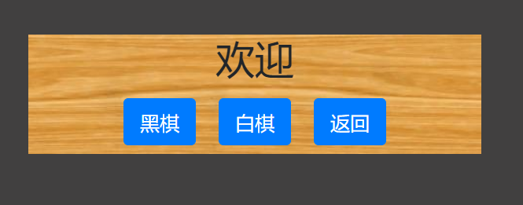
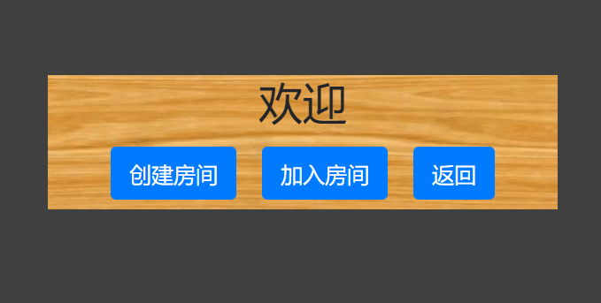
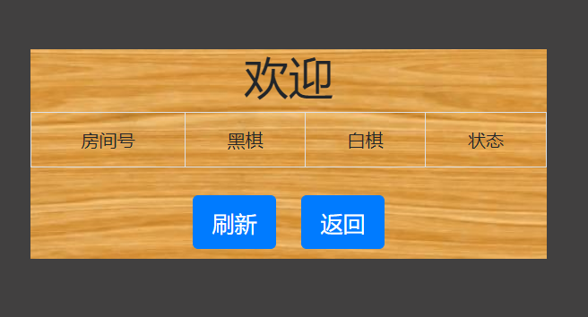
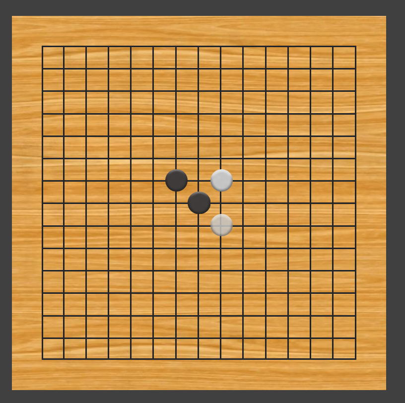

# Gomoku-Platform
***
## Introduction
The project is the final assignment of the Web course.The project is a platform for gomoku, user can play the gomoku by three modes, local play mode, ai play mode and net play mode.
<br>
The front end uses the HTML, CSS, Javascript with jQuery and the web socket.
<br>
THe back end is based on the Node.js and built by Express framework.
## Environment
* Node.js
* jQuery
* Mysql

## Start Server
* Download the project
* Create the database by Mysql
* Run ```npm install``` to install the dependent package
* Run ``` source init_table.sql; ``` in Mysql to initialize the database.
* Run ```forever start server.js``` to start the server
* The port of the server is 51659

## Functions
### Sign In and Sign Up
* If user is not be signed in the platform, whaterver user access the web page of the platform, it will be redirected to the login page.
* Using the session to keep the login status in server.
* Sign up page



* Sign in page


### Main Room page
* If user has signed in, user will enter the main page.
* When user in the main page, there are three modes of the game to choose.
* The main page



* If user chooses the local play mode, user will enter the playing page.
* If user chooses the ai play mode, user can choose what color he like to play and enter the playing page.



* If user chooses the net play mode, user can create a room or join a room to play with others through the net and only the one who creates the room can choose the color of game.



* Join Room page



### Gomoku Board
* The board is built by HTML and CSS.
* Each go is a div with go image.
* The board is made up of many div with solid border.
* Use the jQuery to change dom to change the board.


### Local Play Mode
* For two local player to play.
* When one set the go on the board, the color of the go is changed and turn to the other.

### Ai Play Mode
* Player can play with a simple ai.
* AI Achievement
	* Analyse the different go pattern to generate the score of the now situation.
	* Use the alpha beta prune to optimize the search tree.
	* Prune some location around which the point is blank.
	* Analyse the now situation before search and sort the point can be set by decreasing order to optimize the alpha beta prune.
### Net Play Mode
* Use web socket to connect with other player through server.
* When player enter the room, send the player information and the room information to the server.
* When two player both enter the room, server send the "ok" command to both.
* Two player send the location of the go set to ther server and server forward the information to the other.
* If someone disconnect, server send the "end" command to inform the other player that opponent has disconnected.

## Directory Structure
|-- gomoku-platform
    |-- .gitignore
    |-- ai_mode.png
    |-- board.png
    |-- config.json
    |-- config_example.json
    |-- join.png
    |-- main_room.png
    |-- net_mode.png
    |-- package-lock.json
    |-- package.json
    |-- README.md
    |-- server.js
    |-- signin.png
    |-- signup.png
    |-- css
    |   |-- style.css
    |-- html
    |   |-- board.html
    |   |-- index.html
    |   |-- room.html
    |-- js
    |   |-- board.js
    |   |-- game.js
    |   |-- index.js
    |   |-- init_room.js
    |   |-- lib.js
    |-- lib
    |   |-- ai.js
    |   |-- database.js
    |   |-- delete_room.js
    |-- resources
    |   |-- black_go.png
    |   |-- board_base.jpg
    |   |-- wait_black_go.png
    |   |-- wait_white_go.png
    |   |-- white_go.png
    |-- SQLs
        |-- init_table.sql
